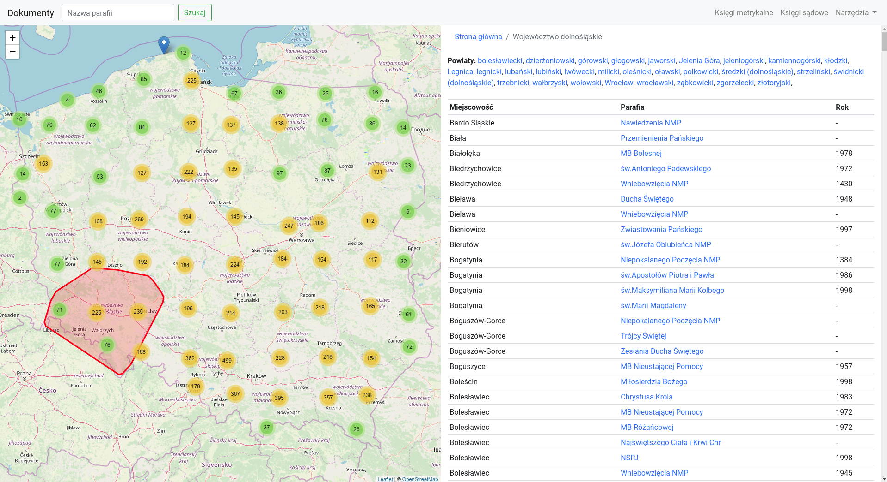

Virtualenv setup
================

```bash
apt install libmysqlclient-dev

python3 -m venv .env
source .env/bin/activate
```

Installation
============

```bash
pip3 install -r requirements.txt
python3 manage.py migrate
python3 manage.py createsuperuser
python3 manage.py collectstatic

HTTP_PROTOCOL=http HTTP_HOST=127.0.0.1:8000 python3 manage.py runserver

update `core_parish` SET diocese_id=null WHERE diocese_id=44
```

Lokalizacja

```bash
python3 manage.py makemessages -l en
python3 manage.py makemessages -l pl
python3 manage.py compilemessages

```

Screen
======



Data sources
============
- https://www.familysearch.org/
- http://geneteka.genealodzy.pl/
- http://szukajwarchiwach.pl
- http://metryki.genbaza.pl
- http://poznan-project.psnc.pl/
- http://basia.famula.pl/
- docs/ksiegi-parafialne
- http://www.mikeburger.com/rzeszow.html
- http://www.semanchuk.com/gen/wzbr/index.html
- https://pgsa.org/polmarindex
- http://www.orbikfamily.com/orbik/Barglow_Koscielny/Barglow_Record_Project.htm
- http://www.szpejankowski.eu/index.php/wykaz-nazwisk.html
- http://www.przodkowie.com/metryki/
- http://www.stankiewicz.e.pl/forum/viewforum.php?f=11&topicdays=0&start=50
- http://www.nowikowie.republika.pl/wawrzyszew.htm
- https://sites.google.com/site/warszawaswjan/home
- http://www.rootsweb.ancestry.com/~polwgw/polandarchives.html#priests
- http://www.ptg.gda.pl/index.php/certificate/action/main
- http://www.slupcagenealogy.com/
- http://www.forgen.pl/forum/
- http://regestry.lubgens.eu/news.php
- http://gladala.com/?option=com_content&view=category&id=9&Itemid=104
- http://praszka.mrog.org/
- http://www.genealodzy.czestochowa.pl/zasoby/biblioteka/Indeksy-zbior%C3%B3w-metrykalnych
- http://turze.net/genbaza.html
- http://feefhs.org/resource/poland
- https://indeksy.projektpodlasie.pl/

Parafie źródła
==============
- http://mapy.lubgens.eu/polska.html
  http://mapy.lubgens.eu/rzk-r.xml?uid=1543173210186
- http://mapy.lubgens.eu/polska2.html
- http://mapy.lubgens.eu/1772.html
- http://mapy.lubgens.eu/ [w kodzie strony wszystko!]
- https://www.google.com/maps/d/u/0/viewer?mid=1zwYwcXHsVgUW5cDUiPBnALYGkvE
- http://metryki.genealodzy.pl/gmapa.php
  http://metryki.genealodzy.pl/rejestry.php
- https://geneteka.genealodzy.pl/rejestry.php?lang=pol
- http://poznan-project.psnc.pl/page.php?page=content

Indeksacja, dane pochodne
=========================
- http://www.basia.famula.pl/pl/skany
